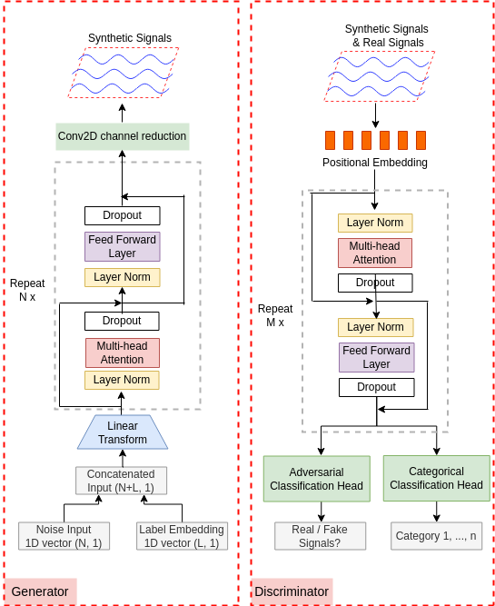

# BioSGAN: Generating Realistic Multi-class Biosignals with BioSGAN: A Transformer-based Label-guided Generative Adversarial Network
---

This repository contains code from the paper "Generating Realistic Multi-class Biosignals with BioSGAN: A Transformer-based Label-guided Generative Adversarial Network".

---

**Abstract:**
Time series data are commonly used in biomedical applications, but such datasets are often small, expensive to collect, and may involve privacy issues that restrict large-scale deep learning models. Data augmentation techniques for time series data are limited by the need to maintain signal properties, but Generative Adversarial Networks (GANs) offer a promising approach for expanding datasets. This paper presents BioSGAN, a transformer-based label-guided GAN model capable of generating multi-class, class-specific synthetic time-series sequences of arbitrary length. Our proposed model architecture and design strategies produce synthetic sequences that are almost indistinguishable from real signals, enabling data augmentation. To evaluate the quality of the generated data, we propose a wavelet coherence metric that compares the similarity of real and synthetic signals. Our results show that BioSGAN outperforms existing state-of-the-art time-series GAN models, as demonstrated by qualitative visualizations using PCA and t-SNE, as well as quantitative comparisons of the discriminative and predictive power of the synthetic data.

**Major Contributions:**

Use transformer-based label-guided GAN model to generate multi-class time-series data

Use Wavelet Coherence score to compare the similarity between two sets of signals.

**The BioSGAN Architecture:** 



---
**Code structure:**

**BioSGAN_model.py**: The BioSGAN model architecture. It contains the code of the transformor-based generator and discriminator. The generator has embedded labels. The discriminator has two classficatio heads, one is for adversarial classification and another one is for categorical classfication.    
**trainBioSGAN.py**: Contains code for model initialization, load dataset, and training process. Several intermediate results will show on the Tensorboard.

**Dataloader.py**: The PyTorch dataloader written for loading mitbih heat beat signals. Download the dataset mitbih_train.csv and mitbih_test.csv from [here](https://www.kaggle.com/code/azazurrehmanbutt/ecg-classification-using-cnn-lstm/data?scriptVersionId=74982392) and save it to your code directory. 

**synDataloader.py**: The PyTorch dataloader written for loading mitbih synthetic signals from pre-trained generator. 

**mitbih_checkpoint**: A pretrained BioSGAN checkpoint.

**biosgan_functions.py, utils.py**: contains some helper functions. 

**adamw.py**: adamw implementation. 

**cfg.py**: the definition of parse arguments. 

**mitbit_Train_BioSGAN.py**: a script used for start model training. 

**classification.ipynb**: Post-hoc classficaiton examples used for generating the plots in paper Figure 10. 

**LookAtData.ipynb**: show some plots of real mitbih heartbeat signals and synthetic signals. 

**The folder Label-embedding**: contains code used for generating the plots in paper Figure 5. 


**Implementation structions:**


To re-train the model: 
```
python mitbih_Train_BioSGAN.py
```
Modify the parse arguments to fit for your dataset. 

---
